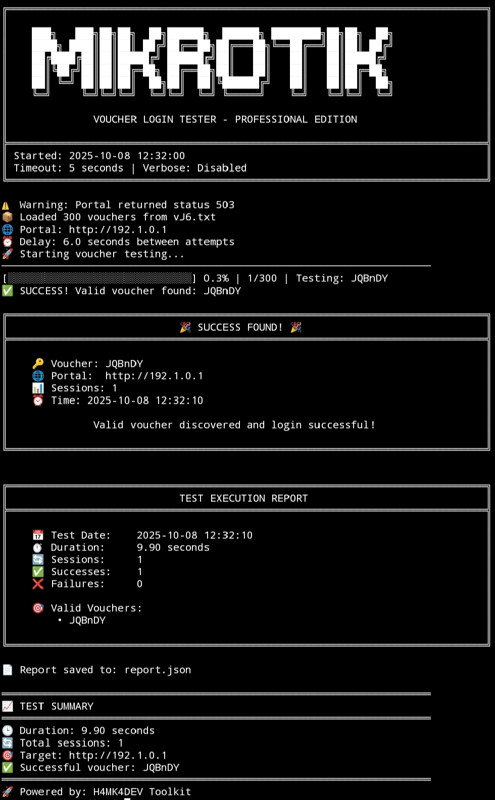

# MikroTik HotSpot Voucher Tester

Utilities for validating voucher-based authentication on MikroTik HotSpot portals and preparing voucher batches for controlled operational or laboratory use.



## Overview

This repository is built around a practical testing workflow for MikroTik HotSpot environments that still expose the familiar CHAP or JavaScript MD5 login pattern. The main tester retrieves the portal page, identifies the authentication form, reconstructs the challenge response when CHAP data is available, falls back to PAP when it is not, and evaluates the outcome from redirects, response content, and the final location returned by the server.

Alongside the tester, the project includes an optional LLM-assisted diagnostic helper for failed runs and a separate voucher generator intended for batch preparation.

## Project Structure

| Path | Role |
| --- | --- |
| `mikrotik_jsmd5_loginv2.py` | Main command-line tester for single vouchers and wordlists |
| `llm_debug.py` | Optional OpenAI-backed diagnostic helper for saved files or failed attempts |
| `Voucher-generator/vgen.py` | Standalone voucher generator for batch creation |
| `tests/` | Regression tests for parsing, success detection, and LLM helper behavior |

## Functional Scope

| Area | Description |
| --- | --- |
| Voucher testing | Supports both single-value checks and bulk execution from a wordlist |
| CHAP handling | Extracts challenge data from JavaScript fragments and hidden input fields |
| PAP fallback | Continues with plain credential submission when CHAP material is unavailable |
| Result evaluation | Inspects redirect history, response body, and final URL before classifying the result |
| Diagnostic output | Provides verbose request and response logging for troubleshooting |
| Assisted analysis | Offers optional AI-based review of failed runs or stored debug material |

## Runtime Requirements

| Requirement | Purpose |
| --- | --- |
| Python 3.8 or newer | Base runtime |
| `requests` | HTTP communication for the tester |
| `openai` | Optional dependency for the LLM helper |

To install the full environment:

```bash
pip install -r requirements.txt
```

If only the tester is required:

```bash
pip install requests
```

## Usage

### Single Voucher Validation

```bash
python mikrotik_jsmd5_loginv2.py -u http://192.168.88.1 --voucher TEST123
```

### Wordlist Execution

```bash
python mikrotik_jsmd5_loginv2.py -u http://192.168.88.1 -w vouchers.txt -o report.txt
```

### Verbose Troubleshooting

```bash
python mikrotik_jsmd5_loginv2.py -u hotspot.local -w vouchers.txt -v
```

### Post-Failure Analysis with the Optional LLM Helper

After setting `OPENAI_API_KEY`:

```bash
python mikrotik_jsmd5_loginv2.py -u hotspot.local -w vouchers.txt -v --llm-debug
```

### Analysis of a Saved HTML or Log File

```bash
python mikrotik_jsmd5_loginv2.py --analyze-file failed_login.html
```

## Command Reference

| Option | Meaning |
| --- | --- |
| `-u`, `--url` | Target portal URL or hostname |
| `--voucher` | Single voucher input |
| `-w`, `--wordlist` | File containing multiple voucher values |
| `-t`, `--timeout` | HTTP timeout in seconds |
| `-d`, `--delay` | Delay between attempts |
| `-o`, `--output` | File path for the generated summary |
| `-v`, `--verbose` | Detailed request and response output |
| `--no-progress` | Disables the progress display |
| `--llm-debug` | Sends the most recent failed attempt to the optional analyzer |
| `--analyze-file` | Analyzes a stored HTML or log file and exits |
| `--analyze-model` | Selects the OpenAI model used by the analyzer |

For the complete CLI reference:

```bash
python mikrotik_jsmd5_loginv2.py --help
```

## Authentication Workflow

| Stage | Operation |
| --- | --- |
| 1 | Request the login page from the target portal |
| 2 | Detect the form action and any available challenge material |
| 3 | Compute the MD5 response when CHAP data is present |
| 4 | Submit the voucher using CHAP or PAP as required |
| 5 | Interpret the response from redirects, content, and final destination |

## Optional LLM Diagnostics

The diagnostic helper is intentionally separate from the authentication flow. It is invoked only when explicitly requested, either after a failed run or when a saved file is passed for review. Before building the analysis payload, the helper masks voucher values and request details so the context remains suitable for diagnostic use.

| Condition | Requirement |
| --- | --- |
| Dependency | `openai` package must be installed |
| Credential | `OPENAI_API_KEY` must be available in the environment |
| Behavior | Analysis is additive; it does not modify the tester workflow |

## Voucher Generator

The voucher generator in `Voucher-generator/vgen.py` is a separate utility. Its role is to prepare voucher batches for staging, testing, or operational distribution, and it can be used independently of the login tester.

## Operational Considerations

| Topic | Detail |
| --- | --- |
| Result confidence | Success detection is heuristic and should not be treated as router-side truth |
| Portal variation | Customized templates may use non-standard fields or altered JavaScript flows |
| Session handling | Some deployments require cookies, intermediate redirects, or additional portal state |
| AI assistance | The LLM helper can accelerate diagnosis, but it does not replace router logs, packet capture, or server-side inspection |

## Legal and Ethical Use

Use this project only against systems that you own or are explicitly authorized to assess. Testing third-party captive portals or production infrastructure without written permission is outside the intended use of this repository.

## License

This project is released under the MIT License. See [LICENSE](LICENSE) for the full text.
